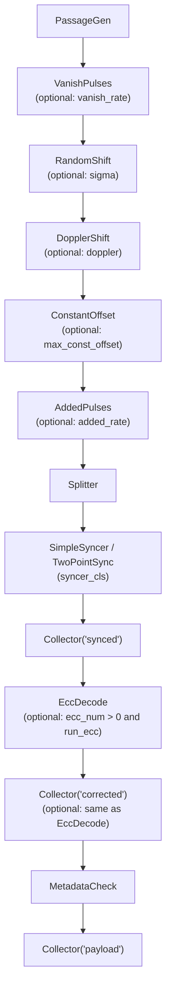
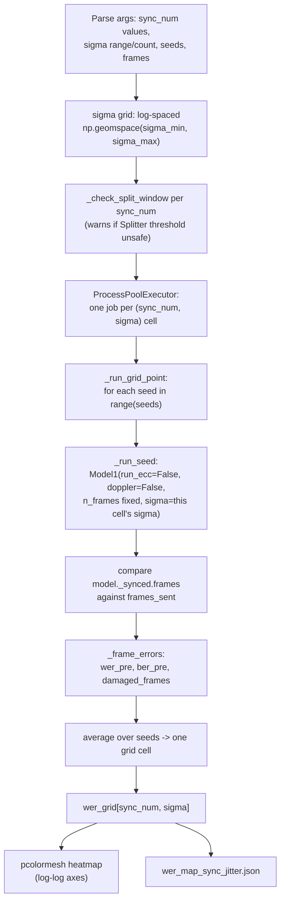
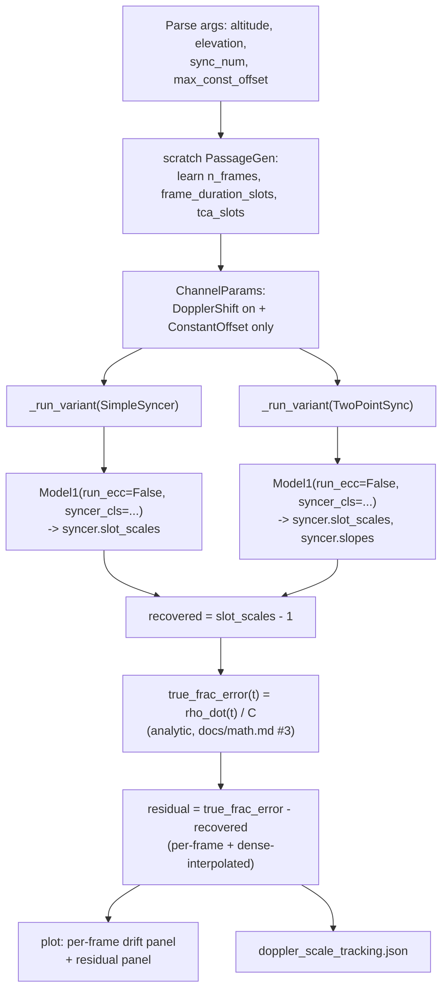

# Modeling

The modeling part generates a transmission, sends it through a simulated channel, and decodes it.
It answers one question: does the decoder still recover the data under a given level of noise,
Doppler shift and pulse loss?

`Model1` in `src/coding_synchronization/Model.py` builds this part. `main.py` runs it.
[`docs/why.md`](why.md) states which question a run answers, and [`docs/math.md`](math.md) states
what each stage computes.

## Pipeline order

`Model1.construct_pipeline` appends these stages, in this exact order:

1. `PassageGen` — generates the frames of one satellite pass.
2. `VanishPulses` — removes each pulse with a fixed probability.
3. `RandomShift` — moves each pulse by a random amount.
4. `DopplerShift` — stretches the time axis, as the range rate of the satellite does.
5. `ConstantOffset` — adds one fixed offset to a whole frame.
6. `AddedPulses` — inserts spurious pulses at random positions.
7. `Splitter` — cuts the pulse stream into chunks.
8. `SimpleSyncer` (or `TwoPointSync`, via `Model1`'s `syncer_cls` argument) — locates the sync
   section and decodes the words.
9. `Collector("synced")` — keeps the words as `Syncer` decoded them, before ECC touches them.
10. `EccDecode` — corrects each frame with its Reed-Solomon parity. Present only when
    `frame_params.ecc_num > 0` and `run_ecc=True`; `Model1(run_ecc=False)` keeps the stage out
    of the run entirely, which is what the `s_scripts/` sweeps use to skip the most expensive
    stage per frame when the question they ask does not need it.
11. `Collector("corrected")` — keeps the words after ECC correction. Present only when step 10 is.
12. `MetadataCheck` — verifies the metadata counter, and removes those words. Runs after ECC, so
    it always tests corrected words.
13. `Collector("payload")` — keeps the final decoded payload.

`Model1` appends each channel impairment (steps 2–6) only when its `ChannelParams` field holds a
value. A field of `None` therefore removes that stage from the run. The `Channel` compound stage
applies the same rule. [`docs/math.md`](math.md#3-channel) gives the model of each impairment.

[`docs/pipeline.md`](pipeline.md) describes the stages from step 7 onward. The measurement part
uses the same five, plus `FrameFilter` and up to two more `Collector` taps of its own.



## Transmitter stages

**`FrameGen`** builds the words of one frame, in this order:

- `sync_num` sync words. `FrameGen.coarse_sync` gives them all the value 0. The receiver only
  has to know the value, so it is a free parameter, and the current hardware sends 1023.
- `metadata_num` metadata words. They hold a counter that increases by one for each word.
- `data_num` data words. They hold the payload.
- `ecc_num` ECC words. `_fill_ecc` writes Reed-Solomon parity over the metadata words and the data
  words. It builds its codec with the same `Ecc.make_codec` that the decoder uses, so the two can
  never disagree about the field or the generator.
- `eof_num` EOF words. They carry no pulse and form the gap between frames.

`FrameGen._to_positions` turns the word values into pulse positions.
[`docs/math.md`](math.md#1-frame-and-timing) gives the equation.

**`Modulation`** holds `ModulationParams` only. The PPM parameters live there.

**`PassageGen`** decides how many frames one satellite pass carries. `_elevation_to_time` computes
the pass duration from the orbital altitude and the peak elevation angle. `PassageParams.time_s`
caps that duration when it is set. `PassageGen` then divides the duration by the frame duration.

`PassageGen` also fits the data to the pass. It truncates data that is too long. It repeats data
that is too short. It generates random words when the caller passes `data=None`.

## Parameters

| Dataclass | Field | Meaning |
|---|---|---|
| `ModulationParams` | `ppm_rank` | A word carries `2^ppm_rank` possible values. |
| | `slot_time` | The duration of one slot, in seconds. |
| | `dead_slots` | Slots added after the PPM range of each word. |
| `FrameParams` | `sync_num`, `metadata_num`, `data_num`, `ecc_num` | The number of words in each section. |
| | `eof_num` | The length of the gap between frames, in words. |
| `PassageParams` | `altitude_km`, `max_elevation_deg` | The orbit and the peak elevation of the pass. |
| | `time_s` | An optional cap on the pass duration. |
| `ChannelParams` | `sigma` | The standard deviation of `RandomShift`, in slots. |
| | `vanish_rate`, `added_rate` | The share of pulses that disappear or appear. `None` disables the stage. |
| | `max_const_offset` | The largest offset that `ConstantOffset` applies. |
| | `chirp_duration_s`, `tca_chirp` | The `DopplerShift` settings. |

## Run it

```bash
uv run main.py
```

`main.py` sets every parameter in the file itself. Edit the file to change a run. The results go to
`output/<timestamp>/`.

`test/test_model1.py` is the worked example. It runs the pipeline with a very small `sigma`, and
with no pulse loss. It then asserts that the recovered payload matches the transmitted payload
exactly. Read that test before you change a decoder stage.

A run ends with two reports. The ECC report gives the error rates of the frames. The metadata
report gives the share of frames whose counter did not match. Together they answer the question of
[`docs/why.md`](why.md): does this configuration survive this channel?

## Sweep scripts

`s_scripts/` answers a question `docs/math.md` states but leaves open, by running many `Model1`
instances instead of deriving a closed form. Each script builds its own `Model1` per point of its
sweep, so it does not reuse the pipeline description above directly — it repeats the pieces of it
that the question needs.

### `simulate_wer_map_sync_jitter.py`

Answers [`docs/math.md`](math.md#7-synchronization)'s open bound on how many sync pulses a frame
needs against a given clock jitter. It runs `Model1` with `run_ecc=False` and `doppler=False`, so
the only impairment is `RandomShift`, and compares `Syncer`'s output directly against the words
`FrameGen` actually sent — not against an `EccReport` — because ECC never runs.



### `simulate_doppler_scale_tracking.py`

Answers the second open bound of the same section: the curvature residual `TwoPointSync` leaves
behind, compared against `SimpleSyncer`'s. The channel carries only `DopplerShift` and a per-frame
`ConstantOffset` — no jitter, no pulse loss or addition — because those two impairments are the
ones a scale fit can absorb for free, so anything left over is the curvature error under test.


